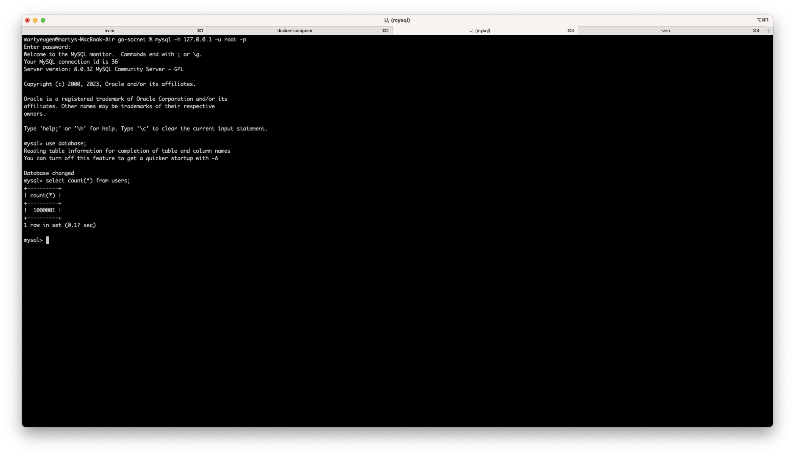
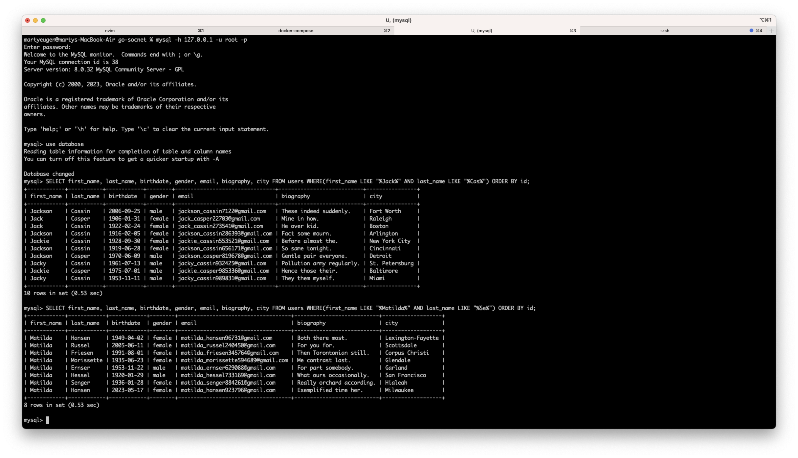
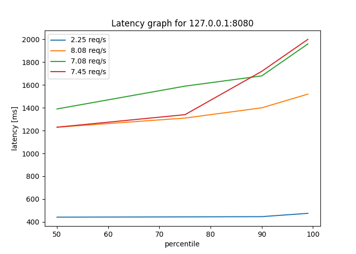
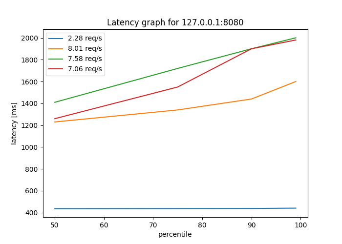

# Отчет о проделанной работе

## База данных

Для теста мы создали базу и заполнили ее 1млн пользователями(+1 наш, для аутентификации)



## Запросы
Для тестов мы будем использовать 2 запроса, запрос "Матильда" и запрос "Джэк"

```
SELECT first_name, last_name, birthdate, gender, email, biography, city FROM users WHERE(first_name LIKE "%Matilda%" AND last_name LIKE "%Se%") ORDER BY id;

SELECT first_name, last_name, birthdate, gender, email, biography, city FROM users WHERE(first_name LIKE "%Jack%" AND last_name LIKE "%Cas%") ORDER BY id;
```

Проведем их чтобы удостовериться что они работают




### EXPLAIN для обоих запросов

Матильда
```
           id: 1
  select_type: SIMPLE
        table: users
   partitions: NULL
         type: index
possible_keys: NULL
          key: PRIMARY
      key_len: 8
          ref: NULL
         rows: 911950
     filtered: 1.23
        Extra: Using where

EXPLAIN: -> Filter: ((users.first_name like '%Matilda%') and (users.last_name like '%Se%'))  (cost=97868.36 rows=11256) (actual time=92.222..581.822 rows=8 loops=1)
    -> Index scan on users using PRIMARY  (cost=97868.36 rows=911950) (actual time=0.186..496.603 rows=1000001 loops=1)
```

Джек
```
           id: 1
  select_type: SIMPLE
        table: users
   partitions: NULL
         type: index
possible_keys: NULL
          key: PRIMARY
      key_len: 8
          ref: NULL
         rows: 911950
     filtered: 1.23
        Extra: Using where


EXPLAIN: -> Filter: ((users.first_name like '%Jack%') and (users.last_name like '%Cas%'))  (cost=97868.36 rows=11256) (actual time=10.479..575.753 rows=10 loops=1)
    -> Index scan on users using PRIMARY  (cost=97868.36 rows=911950) (actual time=0.131..494.368 rows=1000001 loops=1)
```

## Нагрузочное тестирование

В первую очередь убедимся что запросы работают.

```
curl --location '127.0.0.1:8080/user/search' \
    --header 'Content-Type: application/json' \
    --header 'Cookie: session_token=2af94cdc-fa18-405a-9168-af27a4068205' \
    --data '{"first_name":"Matilda", "last_name": "Se"}'
```

Для нагрузочного тестирования будем использовать утилиту wrk


wrk -t5 -c10 -d1m -H "Cookie: session_token=1d133fde-b12e-4f04-8b76-07b161628802" -s ./scripts/matilda.lua --latency "http://127.0.0.1:8080/user/search"

Где:
* -tn - число потоков
* -cn - число подключений
* -dnm - время проверки(1 минута в нашем случае)

Результаты тестов можно посмотреть в папке results. Графики

Матильда:


Джэк:


Как мы видим из графиков, при увеличении нагрузки latency увеличивается а throuhput падает. Результаты для обоих случаев похожие, что мы и ожидали.

Так же, при большом количестве запросов начинают появляться ошибки подключения. На графиках это не отображено, но можно посмотреть в логах тестирования, например:

```
Running 1m test @ http://127.0.0.1:8080/user/search
  5 threads and 1000 connections
  Thread Stats   Avg      Stdev     Max   +/- Stdev
    Latency     1.30s   251.58ms   2.00s    82.35%
    Req/Sec     2.62      4.04    30.00     86.42%
  Latency Distribution
     50%    1.23s
     75%    1.34s
     90%    1.72s
     99%    2.00s
  447 requests in 1.00m, 764.79KB read
  Socket errors: connect 752, read 220, write 0, timeout 430
Requests/sec:      7.45
Transfer/sec:     12.74KB
```