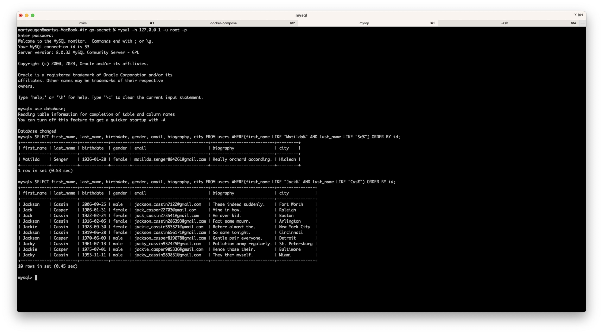
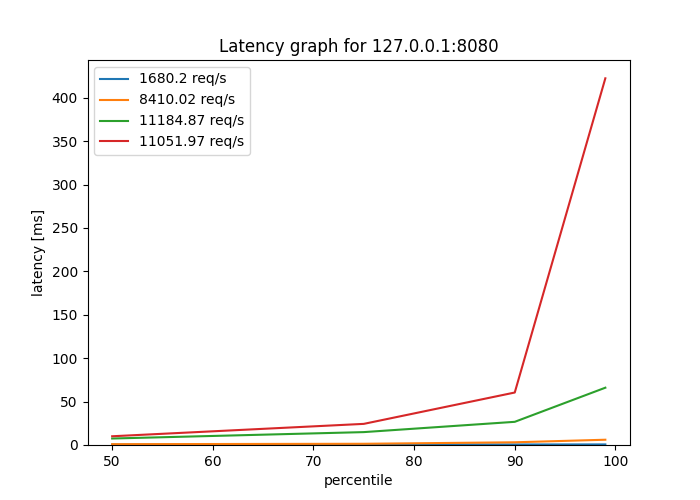
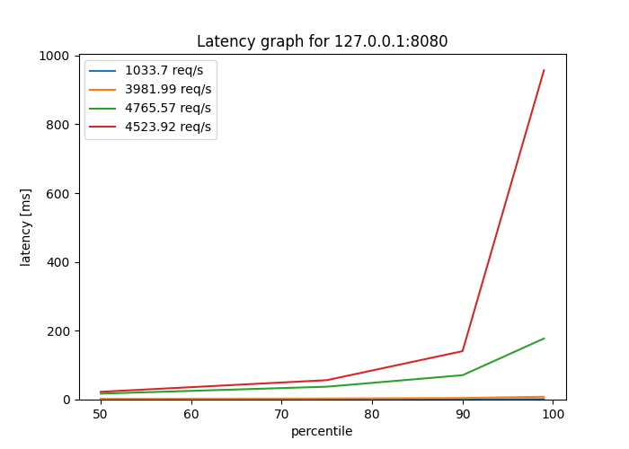

# Отчет о проделанной работе

## База данных

Для теста мы создали базу и заполнили ее 1млн пользователями(+1 наш, для аутентификации)


## Запросы
Для тестов мы будем использовать 2 запроса, запрос "Матильда" и запрос "Джэк"

```
SELECT first_name, last_name, birthdate, gender, email, biography, city FROM users WHERE(first_name LIKE "Matilda%" AND last_name LIKE "Se%") ORDER BY id;

SELECT first_name, last_name, birthdate, gender, email, biography, city FROM users WHERE(first_name LIKE "Jack%" AND last_name LIKE "Cas%") ORDER BY id;
```

Проведем их чтобы удостовериться что они работают




### EXPLAIN для обоих запросов

Матильда
```
           id: 1
  select_type: SIMPLE
        table: users
   partitions: NULL
         type: index
possible_keys: NULL
          key: PRIMARY
      key_len: 8
          ref: NULL
         rows: 893747
     filtered: 1.23
        Extra: Using where
```

Джек
```
           id: 1
  select_type: SIMPLE
        table: users
   partitions: NULL
         type: index
possible_keys: NULL
          key: PRIMARY
      key_len: 8
          ref: NULL
         rows: 893747
     filtered: 1.23
        Extra: Using where
```

## Нагрузочное тестирование

Тестировать будем следующую точку входа
```
curl --location '127.0.0.1:8080/user/search' \
    --header 'Content-Type: application/json' \
    --header 'Cookie: session_token=2af94cdc-fa18-405a-9168-af27a4068205' \
    --data '{"first_name":"Matilda", "last_name": "Se"}'
```

Для нагрузочного тестирования будем использовать утилиту wrk, пример запроса:

wrk -t5 -c10 -d1m -H "Cookie: session_token=1d133fde-b12e-4f04-8b76-07b161628802" -s ./scripts/matilda.lua --latency "http://127.0.0.1:8080/user/search"

Где:
* -tn - число потоков
* -cn - число подключений
* -dnm - время проверки(1 минута в нашем случае)
* -s - файл скрипта, где хранятся данные и метод запроса.

Результаты тестов можно посмотреть в папке results. Графики

Матильда:


Джэк:


Как мы видим из графиков, при увеличении нагрузки latency увеличивается а throuhput падает. Результаты для обоих случаев похожие, что мы и ожидали.

Так же, при большом количестве запросов начинают появляться ошибки подключения. На графиках это не отображено, но можно посмотреть в логах тестирования, например:

```
Running 1m test @ http://127.0.0.1:8080/user/search
  5 threads and 1000 connections
  Thread Stats   Avg      Stdev     Max   +/- Stdev
    Latency     1.30s   251.58ms   2.00s    82.35%
    Req/Sec     2.62      4.04    30.00     86.42%
  Latency Distribution
     50%    1.23s
     75%    1.34s
     90%    1.72s
     99%    2.00s
  447 requests in 1.00m, 764.79KB read
  Socket errors: connect 752, read 220, write 0, timeout 430
Requests/sec:      7.45
Transfer/sec:     12.74KB
```

## Добавление индекса

Для запроса из задачи лучше всего подойдет следующий индекс
```
create index inx_name ON users (first_name, last_name);
```
Отдельный инлекс для ID создавать не нужно, так как MySQL по умолчанию делает индекс для primary key

EXPLAIN для обоих запросов

Матилда
```
           id: 1
  select_type: SIMPLE
        table: users
   partitions: NULL
         type: range
possible_keys: inx_name
          key: inx_name
      key_len: 2044
          ref: NULL
         rows: 64
     filtered: 11.11
        Extra: Using index condition; Using filesort
```
Джэк
```
           id: 1
  select_type: SIMPLE
        table: users
   partitions: NULL
         type: range
possible_keys: inx_name
          key: inx_name
      key_len: 2044
          ref: NULL
         rows: 1956
     filtered: 11.11
        Extra: Using index condition; Using filesort
```

Как видно из отчета - теперь мы используем индекс inx_name

Графики производительности после применения индекса:

Матильда



Джек



Как видно из графиков, количество запросов в секунду(throughput) значительно увеличилось, зато задержка(latency) уменьшилась благодаря использованию индексов. Однако при большом числе подключений задержка все еще растет

```
Running 1m test @ http://127.0.0.1:8080/user/search
  5 threads and 1000 connections
  Thread Stats   Avg      Stdev     Max   +/- Stdev
    Latency    70.35ms  165.36ms   2.00s    93.98%
    Req/Sec     0.91k   282.48     1.83k    65.13%
  Latency Distribution
     50%   22.69ms
     75%   56.51ms
     90%  140.79ms
     99%  956.77ms
  271738 requests in 1.00m, 538.77MB read
  Socket errors: connect 752, read 115, write 0, timeout 240
Requests/sec:   4523.92
Transfer/sec:      8.97MB
```

Для дальнейшей оптимизации нужно присмотреться к сетевой нагрузке