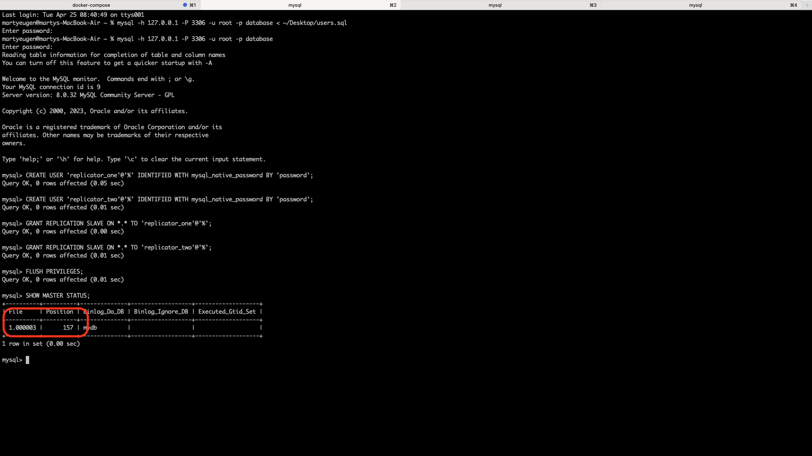
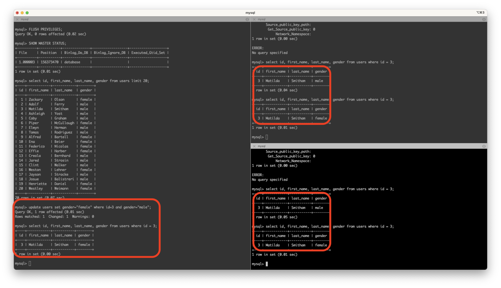

# Репликация

## Настройка

Для начала создадим на мастере пользователя для репликации
```
CREATE USER 'replicator_one'@'%' IDENTIFIED WITH mysql_native_password BY 'password';
CREATE USER 'replicator_two'@'%' IDENTIFIED WITH mysql_native_password BY 'password';
```

И дадим ему нужные права

GRANT REPLICATION SLAVE ON *.* TO 'replicator_one'@'%';
GRANT REPLICATION SLAVE ON *.* TO 'replicator_two'@'%';
FLUSH PRIVILEGES;

Получим статус мастера
```
SHOW MASTER STATUS;
```


Из этой таблицы нам нужны данные:
```
Binlog: 1.000003
Position: 156373470
```

Дальше, запустим репликацию на слейвах:
```
CHANGE REPLICATION SOURCE TO
SOURCE_HOST='mysql_master',
SOURCE_USER='replicator_one',
SOURCE_PASSWORD='password',
SOURCE_LOG_FILE='1.000003',
SOURCE_LOG_POS=156373470;

START REPLICA;
```
  
Запросим статус и убеждаемся что ошибок нет:

```
SHOW REPLICA STATUS\G;
*************************** 1. row ***************************
             Replica_IO_State: Waiting for source to send event
                  Source_Host: mysql_master
                  Source_User: replicator_two
                  Source_Port: 3306
                Connect_Retry: 60
              Source_Log_File: 1.000003
          Read_Source_Log_Pos: 156374100
               Relay_Log_File: 4105bbb2c718-relay-bin.000002
                Relay_Log_Pos: 948
        Relay_Source_Log_File: 1.000003
           Replica_IO_Running: Yes
          Replica_SQL_Running: Yes
              Replicate_Do_DB: database
          Replicate_Ignore_DB:
           Replicate_Do_Table:
       Replicate_Ignore_Table:
      Replicate_Wild_Do_Table:
  Replicate_Wild_Ignore_Table:
                   Last_Errno: 0
                   Last_Error:
                 Skip_Counter: 0
          Exec_Source_Log_Pos: 156374100
              Relay_Log_Space: 1165
              Until_Condition: None
               Until_Log_File:
                Until_Log_Pos: 0
           Source_SSL_Allowed: No
           Source_SSL_CA_File:
           Source_SSL_CA_Path:
              Source_SSL_Cert:
            Source_SSL_Cipher:
               Source_SSL_Key:
        Seconds_Behind_Source: 0
Source_SSL_Verify_Server_Cert: No
                Last_IO_Errno: 0
                Last_IO_Error:
               Last_SQL_Errno: 0
               Last_SQL_Error:
  Replicate_Ignore_Server_Ids:
             Source_Server_Id: 1
                  Source_UUID: 0e511b00-e331-11ed-83b6-0242ac120003
             Source_Info_File: mysql.slave_master_info
                    SQL_Delay: 0
          SQL_Remaining_Delay: NULL
    Replica_SQL_Running_State: Replica has read all relay log; waiting for more updates
           Source_Retry_Count: 86400
                  Source_Bind:
      Last_IO_Error_Timestamp:
     Last_SQL_Error_Timestamp:
               Source_SSL_Crl:
           Source_SSL_Crlpath:
           Retrieved_Gtid_Set:
            Executed_Gtid_Set:
                Auto_Position: 0
         Replicate_Rewrite_DB:
                 Channel_Name:
           Source_TLS_Version:
       Source_public_key_path:
        Get_Source_public_key: 0
            Network_Namespace:
1 row in set (0.00 sec)
```

Проверяем и убеждаештся что репликация работает


