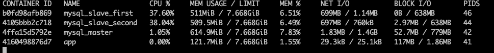

# Репликация

## Настройка

Для начала создадим на мастере пользователя для репликации
```
CREATE USER 'replicator_one'@'%' IDENTIFIED WITH mysql_native_password BY 'password';
CREATE USER 'replicator_two'@'%' IDENTIFIED WITH mysql_native_password BY 'password';
```

И дадим ему нужные права

GRANT REPLICATION SLAVE ON *.* TO 'replicator_one'@'%';
GRANT REPLICATION SLAVE ON *.* TO 'replicator_two'@'%';
FLUSH PRIVILEGES;

Получим статус мастера
```
SHOW MASTER STATUS;
```


Из этой таблицы нам нужны данные:
```
Binlog: 1.000003
Position: 156373470
```

Дальше, запустим репликацию на слейвах:
```
CHANGE REPLICATION SOURCE TO
SOURCE_HOST='mysql_master',
SOURCE_USER='replicator_one',
SOURCE_PASSWORD='password',
SOURCE_LOG_FILE='1.000003',
SOURCE_LOG_POS=156373470;

START REPLICA;
```
  
Запросим статус и убеждаемся что ошибок нет:

```
SHOW REPLICA STATUS\G;
*************************** 1. row ***************************
             Replica_IO_State: Waiting for source to send event
                  Source_Host: mysql_master
                  Source_User: replicator_two
                  Source_Port: 3306
                Connect_Retry: 60
              Source_Log_File: 1.000003
          Read_Source_Log_Pos: 156374100
               Relay_Log_File: 4105bbb2c718-relay-bin.000002
                Relay_Log_Pos: 948
        Relay_Source_Log_File: 1.000003
           Replica_IO_Running: Yes
          Replica_SQL_Running: Yes
              Replicate_Do_DB: database
          Replicate_Ignore_DB:
           Replicate_Do_Table:
       Replicate_Ignore_Table:
      Replicate_Wild_Do_Table:
  Replicate_Wild_Ignore_Table:
                   Last_Errno: 0
                   Last_Error:
                 Skip_Counter: 0
          Exec_Source_Log_Pos: 156374100
              Relay_Log_Space: 1165
              Until_Condition: None
               Until_Log_File:
                Until_Log_Pos: 0
           Source_SSL_Allowed: No
           Source_SSL_CA_File:
           Source_SSL_CA_Path:
              Source_SSL_Cert:
            Source_SSL_Cipher:
               Source_SSL_Key:
        Seconds_Behind_Source: 0
Source_SSL_Verify_Server_Cert: No
                Last_IO_Errno: 0
                Last_IO_Error:
               Last_SQL_Errno: 0
               Last_SQL_Error:
  Replicate_Ignore_Server_Ids:
             Source_Server_Id: 1
                  Source_UUID: 0e511b00-e331-11ed-83b6-0242ac120003
             Source_Info_File: mysql.slave_master_info
                    SQL_Delay: 0
          SQL_Remaining_Delay: NULL
    Replica_SQL_Running_State: Replica has read all relay log; waiting for more updates
           Source_Retry_Count: 86400
                  Source_Bind:
      Last_IO_Error_Timestamp:
     Last_SQL_Error_Timestamp:
               Source_SSL_Crl:
           Source_SSL_Crlpath:
           Retrieved_Gtid_Set:
            Executed_Gtid_Set:
                Auto_Position: 0
         Replicate_Rewrite_DB:
                 Channel_Name:
           Source_TLS_Version:
       Source_public_key_path:
        Get_Source_public_key: 0
            Network_Namespace:
1 row in set (0.00 sec)
```

Проверяем и убеждаештся что репликация работает


Попробуем сделать запрос на поиск, нагружающий только slave
Используем для этого утилиту wrk

```
 wrk -t5 -c10 -d1m -H "Cookie: session_token=6e894c5d-5486-4d84-8573-99798abfb6e3" -s ./scripts/matilda.lua --latency "http://127.0.0.1:8080/user/search"

 Running 1m test @ http://127.0.0.1:8080/user/search
  5 threads and 10 connections
  Thread Stats   Avg      Stdev     Max   +/- Stdev
    Latency     1.19s   409.69ms   2.00s    58.95%
    Req/Sec     2.00      2.42    10.00     92.27%
  Latency Distribution
     50%    1.10s
     75%    1.57s
     90%    1.78s
     99%    1.98s
  487 requests in 1.00m, 162.17KB read
  Socket errors: connect 0, read 0, write 0, timeout 12
Requests/sec:      8.10
Transfer/sec:      2.70KB
```

Нагрузка на контейнеры


Так как тест проводится на MacOS и в виртуальной машине, процессор на контейнерах нагружается сразу.

Для того чтобы сделать нагрузку на запись будем использовать следующий запрос в базу

```
update users u1, users u2 set u1.first_name = u1.last_name, u1.last_name = u2.first_name where u1.id = u2.id AND u1.id >= FIRST AND u1.id <= LAST
```

Таким образом мы будем непрерывно менять местами иия и фамилию каждого пользователя(на практике скорее всего лучше было бы делать это batch'ами, но для теста сойдет варинт "в лоб")

Вот пример нагрузки на слейвы во время поттягивания изменений



Дальше отключаем мастер.


Смотрим статус на слейве

```
*************************** 1. row ***************************
             Replica_IO_State: Reconnecting after a failed source event read
                  Source_Host: mysql_master
                  Source_User: replicator_one
                  Source_Port: 3306
                Connect_Retry: 60
              Source_Log_File: 1.000006
          Read_Source_Log_Pos: 41303060
               Relay_Log_File: b0fd98afb869-relay-bin.000011
                Relay_Log_Pos: 357
        Relay_Source_Log_File: 1.000006
           Replica_IO_Running: Connecting
          Replica_SQL_Running: Yes
              Replicate_Do_DB: database
          Replicate_Ignore_DB:
           Replicate_Do_Table:
       Replicate_Ignore_Table:
      Replicate_Wild_Do_Table:
  Replicate_Wild_Ignore_Table:
                   Last_Errno: 0
                   Last_Error:
                 Skip_Counter: 0
          Exec_Source_Log_Pos: 157
              Relay_Log_Space: 41303516
              Until_Condition: None
               Until_Log_File:
                Until_Log_Pos: 0
           Source_SSL_Allowed: No
           Source_SSL_CA_File:
           Source_SSL_CA_Path:
              Source_SSL_Cert:
            Source_SSL_Cipher:
               Source_SSL_Key:
        Seconds_Behind_Source: 156
Source_SSL_Verify_Server_Cert: No
                Last_IO_Errno: 2005
                Last_IO_Error: error reconnecting to master 'replicator_one@mysql_master:3306' - retry-time: 60 retries: 2 message: Unknown MySQL server host 'mysql_master' (-2)
               Last_SQL_Errno: 0
               Last_SQL_Error:
  Replicate_Ignore_Server_Ids:
             Source_Server_Id: 1
                  Source_UUID: 0e511b00-e331-11ed-83b6-0242ac120003
             Source_Info_File: mysql.slave_master_info
                    SQL_Delay: 0
          SQL_Remaining_Delay: NULL
    Replica_SQL_Running_State: Replica has read all relay log; waiting for more updates
           Source_Retry_Count: 86400
                  Source_Bind:
      Last_IO_Error_Timestamp: 230508 13:33:42
     Last_SQL_Error_Timestamp:
               Source_SSL_Crl:
           Source_SSL_Crlpath:
           Retrieved_Gtid_Set:
            Executed_Gtid_Set:
                Auto_Position: 0
         Replicate_Rewrite_DB:
                 Channel_Name:
           Source_TLS_Version:
       Source_public_key_path:
        Get_Source_public_key: 0
            Network_Namespace:
```

Мы видем что данная транзакция была полностью отменена(это видно по тому что first_name и last_name совпадают с email)


Останавливаем реплику на первом слейве
```
STOP REPLICA;
CREATE USER 'replicator_two'@'%' IDENTIFIED WITH mysql_native_password BY 'password';
GRANT REPLICATION SLAVE ON *.* TO 'replicator_two'@'%';
FLUSH PRIVILEGES;

SHOW MASTER STATUS;

Binlog: 1.000006
Position: 863
```

Теперь на втором слейве
```
STOP REPLICA;

CHANGE REPLICATION SOURCE TO
SOURCE_HOST='mysql_slave_first',
SOURCE_USER='replicator_two',
SOURCE_PASSWORD='password',
SOURCE_LOG_FILE='1.000006',
SOURCE_LOG_POS=863;

START REPLICA;
```

Посмотрим статус репликации
```
show replica status\G;
*************************** 1. row ***************************
             Replica_IO_State: Waiting for source to send event
                  Source_Host: mysql_slave_first
                  Source_User: replicator_two
                  Source_Port: 3306
                Connect_Retry: 60
              Source_Log_File: 1.000006
          Read_Source_Log_Pos: 2733
               Relay_Log_File: 4105bbb2c718-relay-bin.000003
                Relay_Log_Pos: 2188
        Relay_Source_Log_File: 1.000006
           Replica_IO_Running: Yes
          Replica_SQL_Running: Yes
              Replicate_Do_DB: database
          Replicate_Ignore_DB:
           Replicate_Do_Table:
       Replicate_Ignore_Table:
      Replicate_Wild_Do_Table:
  Replicate_Wild_Ignore_Table:
                   Last_Errno: 0
                   Last_Error:
                 Skip_Counter: 0
          Exec_Source_Log_Pos: 2733
              Relay_Log_Space: 2585
              Until_Condition: None
               Until_Log_File:
                Until_Log_Pos: 0
           Source_SSL_Allowed: No
           Source_SSL_CA_File:
           Source_SSL_CA_Path:
              Source_SSL_Cert:
            Source_SSL_Cipher:
               Source_SSL_Key:
        Seconds_Behind_Source: 0
Source_SSL_Verify_Server_Cert: No
                Last_IO_Errno: 0
                Last_IO_Error:
               Last_SQL_Errno: 0
               Last_SQL_Error:
  Replicate_Ignore_Server_Ids:
             Source_Server_Id: 2
                  Source_UUID: 0e84e0a9-e331-11ed-bd7c-0242ac120005
             Source_Info_File: mysql.slave_master_info
                    SQL_Delay: 0
          SQL_Remaining_Delay: NULL
    Replica_SQL_Running_State: Replica has read all relay log; waiting for more updates
           Source_Retry_Count: 86400
                  Source_Bind:
      Last_IO_Error_Timestamp:
     Last_SQL_Error_Timestamp:
               Source_SSL_Crl:
           Source_SSL_Crlpath:
           Retrieved_Gtid_Set:
            Executed_Gtid_Set:
                Auto_Position: 0
         Replicate_Rewrite_DB:
                 Channel_Name:
           Source_TLS_Version:
       Source_public_key_path:
        Get_Source_public_key: 0
            Network_Namespace:
```

Удостоверимся что она работает

